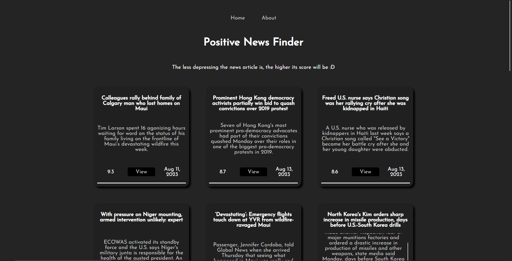

# Positive News Finder Neural Network

This site displays news articles gathered from all over Canada, with the less gloomy ones being displayed at the top. It does this by first gathering articles from various news outlets, then feeding the articles into a neural network that will read them and generate a "positivity" score based on their contents via sentiment analysis.

The less depressing the news article, the higher its score will be :D

## How it works

### The web scraper

#### Gather news feeds

The first step is to gather Canadian news feeds from various outlets, which can be done by accessing each indivdual outlet's [RSS feed](https://en.wikipedia.org/wiki/RSS). This allows us to access the news outlet's updated feed from a single location, making it easy and convenient for us to get the most up-to-date information. In this project, the feeds being gathered are the [CTV News Canada Headlines RSS feed](https://www.ctvnews.ca/rss/ctvnews-ca-canada-public-rss-1.822284) and the [Global News Canada Headlines RSS feed](https://globalnews.ca/canada/feed/).

From the RSS feed, we obtain the news articles' `title`, `description`, `publish date`, and `link` to the full article.

#### Scrape each article from the obtained feed

Once we obtain our feed of articles, we iterate through the list and use [BeautifulSoup](https://pypi.org/project/beautifulsoup4/) to scrape the `text` of each article in full (using the link mentioned earlier). This is done so that we have more stuff to feed into the neural network, leading to a higher level of certainty as to whether or not a specific article is positive, as opposed to if we just fed the model the article's very short `title` and `description`.

#### Preprocess the scraped article text

Naturally, the `text` of each article will be filled with unwanted characters, like commas. Because of this, it gets cleaned so that we can pass it into the model later on without a hitch (and because it looks nicer, obviously).

### The neural network

This is a **Long Short-Term Memory network** (LSTM), which is specifically designed to capture and learn patterns from sequencial data that has long-term dependencies. This makes LSTMs ideal for applications like processing text; text itself is a form of sequential data, made up of words and phrases, that develops more context as the text/phrase grows in size. Here's how it's trained:

#### Gather extensive training data

The first step is to gather some data to train the model. In this project, the Stanford University [IMDb review dataset](http://ai.stanford.edu/~amaas/data/sentiment/) was used, which is filled with tens of thousands of positive and negative reviews for movies, alongside the review's overall film score.

#### Preprocess the training data

Much like with the web scraper, the data obtained is filled with unwanted characters that must be removed so that the model can accept and train with them.

#### Create word embeddings

Standford's pre-trained word embeddings, called [GloVe](https://nlp.stanford.edu/projects/glove/), was used so that the model can better understand the context and nuances of the text in each review that it's being fed for training (remember the "sequential data" mentioned earlier). In order to understand what word embeddings are and how they work, we need to understand how a neural network gets trained:

In order for machines to understand, work, and train with text, it needs to be transformed into a numerical format. This is where word embeddings come into play. Word embeddings are a technique used to represent words as dense vectors of real numbers, capturing the semantic relationships between words in a more meaningful way than traditional methods.

Traditional text-to-numerical representation methods, such as one-hot encoding or bag-of-words, treat words as discrete and independent symbols, meaning they do not take into account the relationships and meanings that words have in a sentence or context. Word embeddings address this limitation by representing words in a continuous vector space, where the proximity of vectors reflects the semantic similarity between words.

For example, in a word embedding space, words with similar meanings, like "happy" and "joyful," would be closer together, while words with different meanings, like "happy" and "sad," would be farther apart. This property enables word embeddings to capture nuances, associations, and context in text that are vital for tasks like sentiment analysis.

In the context of this project, word embeddings play a crucial role in transforming our IMDb review training data into a format that our LSTM model can better comprehend. By representing words as vectors in a continuous space, our model can capture the emotional nuances and context that determine whether a review is positive or negative. The use of word embeddings enhances the model's ability to generalize across different words and expressions, ultimately improving the accuracy of sentiment classification.

#### Train the model

Finally, after all that setup, the model is ready to be trained using the preprocessed review dataset and word embeddings from earlier. The resulting model has a success rate of ~`84%` when it comes to determining whether a given movie review is positive or negative.

#### Feed the previously scraped articles to the model

The file that contains all the scraped articles (`python/data/news.csv`) gets passed to the model, which will in turn evaluate each article's `title`, `description`, and `text` properties and generate a score from 0-10. Naturally, since most news is negative, most of the articles are not being evaluated based on how positive they are, but rather on how much less negative they are compared to the others.

## How to run

All the web scraping code is centralized at `python/web_scraper/main.py`, meaning running this file will go through the entire process of obtaining the feed, scraping the articles, etc.

Running the cells in `python/neural_network/model.ipynb` will go through the process of training the neural network. Running the final cell (`analyze_news("../data/news.csv")`) will feed the scraped articles to the model, determine the scores for them, then save the result in `python/data/display.json`, which will get displayed by the frontend.

Finally, running `npm run dev` in the root directory will show you a frontend that is up-to-date and ready!

## Data

### IMDb Reviews

The IMDb review dataset used to train this model comes can be found [here](http://ai.stanford.edu/~amaas/data/sentiment/)

### GloVe Word Embeddings

The data used to create the embedding layer for the neural network comes from the `glove.6B.zip` folder found [here](https://nlp.stanford.edu/projects/glove/)

**Note**: The word embeddings data file was not copied to this repository, as it is too large :( It should normally be located in `python/neural_network`

## Technologies

Built using:

- [React.js](https://react.dev/)
- [TypeScript](https://www.typescriptlang.org/)
- [Python](https://www.python.org/)
- [BeautfulSoup](https://pypi.org/project/beautifulsoup4/)
- [scikit-learn](https://scikit-learn.org/stable/)
- [NLTK](https://www.nltk.org/)
- [TensorFlow](https://www.tensorflow.org/)
- [Keras](https://keras.io/)
- [Matplotlib](https://matplotlib.org/)
